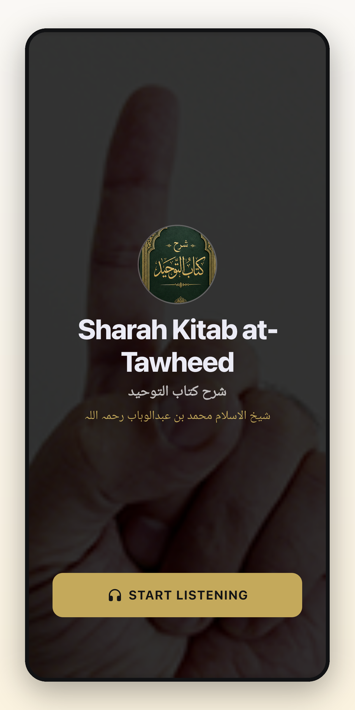
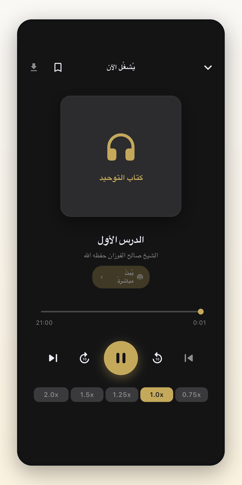
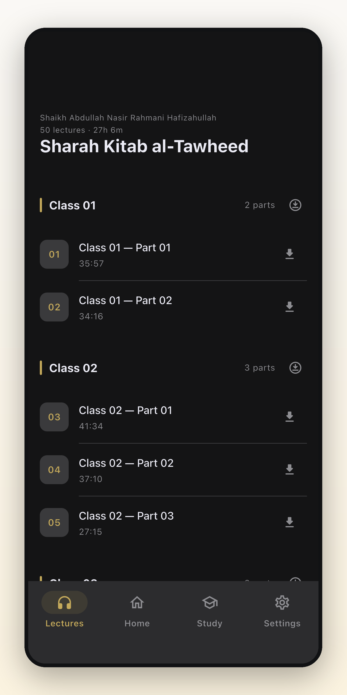

# Sharah Kitab at-Tawheed — شرح کتاب التوحید

[](https://github.com/mdarif/Al-Tawheed/actions/workflows/flutter-ci.yml)
[](https://codecov.io/gh/mdarif/Al-Tawheed)

**Al Marfa Duroos** — a free offline-first audio app for Sharah Kitab at-Tawheed. Choose the Urdu lecture series by Shaikh Abdullah Nasir Rahmani Hafizahullah or the Arabic series by Shaikh Salih al-Fawzan, then stream or download lectures with full lock-screen and notification controls.

**[kitabattawheed.com](https://kitabattawheed.com)** &nbsp;·&nbsp;
**[Play Store](https://play.google.com/store/apps/details?id=com.almarfa.tawheed)** &nbsp;·&nbsp;
**[YouTube — Al Marfa Duroos](https://www.youtube.com/@almarfaduroos)** &nbsp;·&nbsp;
**[Al Marfa Technologies](http://almarfa.co)**

---

<p align="center">
  
  &nbsp;&nbsp;
  
  &nbsp;&nbsp;
  
</p>

---

## Features

- **Two lecture series** — Arabic and Urdu content, selected on first launch
- **Offline playback** — download any lecture for listening without a connection
- **Study Mode** — 15 structured classes to work through the series systematically
- **Background audio** — lock-screen controls and notification transport on Android and iOS
- **Multilingual** — English, Arabic, Urdu, and Roman Urdu interface (four UI locales)
- **Arabic Book** — read the complete Arabic text alongside the Arabic series
- **Urdu Book** — read the bundled Urdu book text alongside the Urdu series
- **Bookmarks** — save any lecture to revisit later
- **Variable speed** — 0.75× to 2.0× playback

---

## Architecture

UI screens never talk to services directly — all shared state flows through
`provider`/`ChangeNotifier` providers, which wrap the services that do
networking, persistence, and playback. `lib/app.dart` wires the full provider
tree with explicit dependency ordering.

```
lib/
  app.dart, app_config.dart, main.dart   # App shell, remote config, entry point
  screens/                               # Routed pages (lectures, player, book, study, settings …)
  widgets/                               # Reusable UI pieces (lecture tiles, offline sheet …)
  providers/                             # ChangeNotifier state: catalog, downloads, progress,
                                         #   connectivity, language, theme, feature flags …
  services/                              # Networking, persistence, downloads, notifications
  audio/                                 # just_audio / audio_service integration
  models/                                # Data classes (lecture/catalog, announcements …)
  theme/                                 # AppColors, ThemeData, Typography
  l10n/                                  # Localization resources (ARB files)
```

**Remote config** — all brand strings, feature flags, and content URLs are driven
from a CDN JSON file (`app-config.json`). Branding and feature changes require no
app release.

**Offline-first** — `ConnectivityProvider` and `DownloadsProvider` drive download
state. `RemoteContentService` serves the catalog with a stale-while-revalidate
strategy so the app always opens instantly.

**Singletons** — `PreferencesService`, `CatalogService`, and
`DownloadNotificationService` are singletons (`.instance`) rather than
constructor-injected. They must be initialised synchronously before the
`MultiProvider` tree is built — this is a deliberate exception, not an oversight.

---

## Local Setup

```bash
flutter pub get
flutter run -d <device-id>
```

Android release signing requires `android/key.properties` (gitignored).
See [docs/setup.md](docs/setup.md) for the full environment setup including
signing and platform-specific notes.

---

## Testing

```bash
flutter test                                         # unit + widget tests
flutter test integration_test/app_test.dart -d <id> # end-to-end on device
```

---

## Documentation

| | |
|---|---|
| ⭐ [Mobile Engineering Playbook](docs/mobile-engineering-playbook.md) | **Portable lessons for future apps** — networking/CDN, offline, testing, release |
| [Agent guide](AGENTS.md) · [Gotchas](docs/gotchas.md) | AI/dev entry point · hard-won landmines |
| [Setup](docs/setup.md) | Environment, dependencies, signing |
| [CI/CD](docs/ci-cd.md) | Pipelines, pre-push hook, release workflow |
| [Deployment](docs/deployment.md) | Build & machine setup guide |
| [Release Runbook](docs/release-runbook.md) | Step-by-step production release process |
| [Git workflow](docs/git-workflow.md) | Branching, commits, PRs |
| [Testing](docs/testing.md) | Running and writing tests |
| [i18n architecture](docs/i18n-architecture.md) | Multilingual content strategy |
| [Remote content strategy](docs/remote-content-strategy.md) | Catalog/announcement caching |
| [Quality backlog](docs/quality-backlog.md) | Current quality status and follow-ups |
| [Troubleshooting](docs/troubleshooting.md) | Common errors and fixes |

---

<p align="center">
  Built by <a href="http://almarfa.co">Al Marfa Technologies</a> &nbsp;·&nbsp;
  <a href="https://kitabattawheed.com">kitabattawheed.com</a>
</p>
